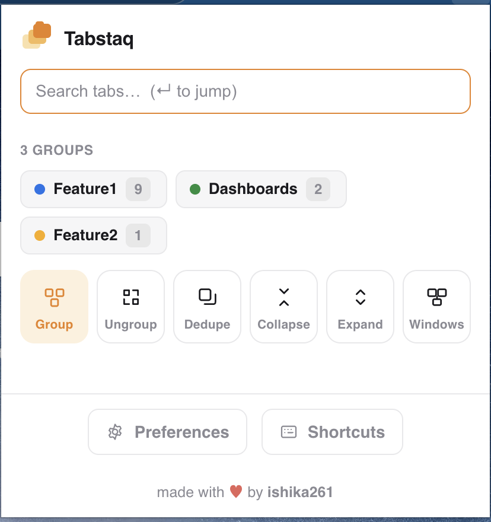
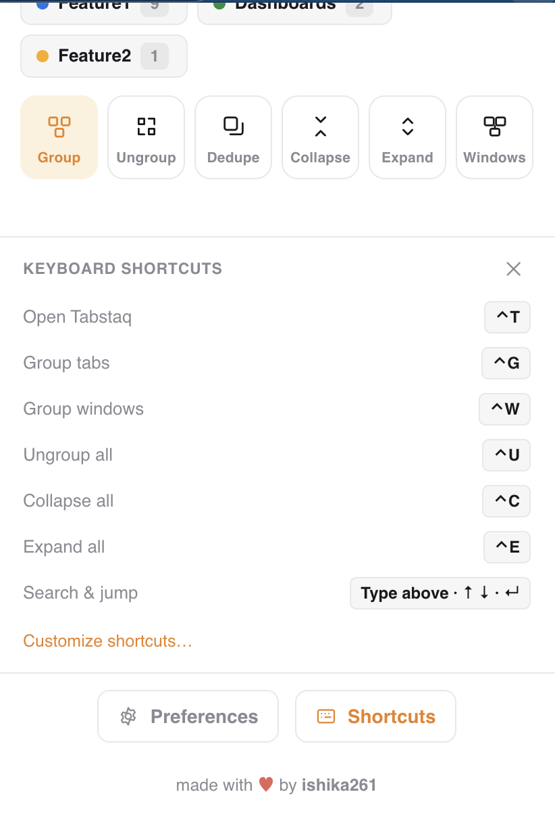
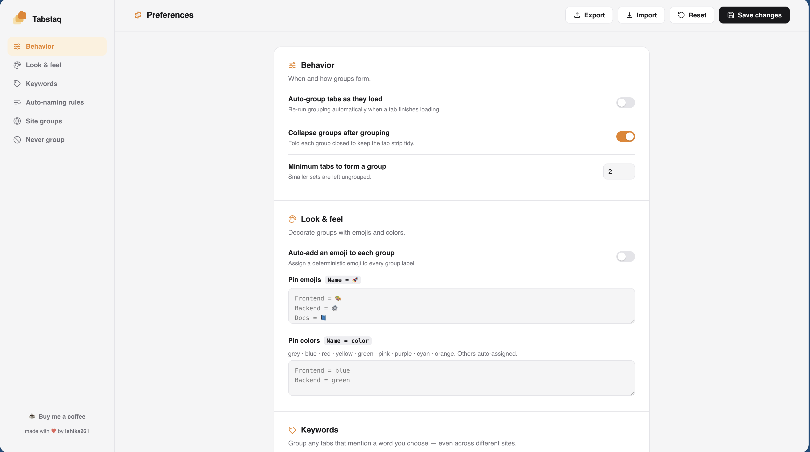

<div align="center">

# 🗂️ Tabstaq

**Browsers organize pages. Tabstaq organizes work.**

Your browser sorts tabs by *where you've been*. But you don't wake up asking
"which sites did I visit?" — you ask "what was I working on?" Tabstaq groups your
tabs by the **project** they belong to, not the domain they live on, so the repo,
its CI pipeline, its design doc, and its ticket sit together as one train of
thought — even though they're spread across four different sites.

📖 **Read the story:** [40 Tabs, Zero Context](https://medium.com/@budhirajaishika/40-tabs-zero-context-6d060e219097)
— why I built Tabstaq and how it works.

<br>



</div>

---

## Why

The problem was never the *number* of tabs — it's that they're sorted by the
wrong thing. Browsers are great at answering "where have you been?" but you open
your laptop asking "what was I working on?" Those aren't the same question.

So work piles up as forty *unrelated* tabs, and when it gets overwhelming you
declare "tab bankruptcy" and close everything. But those tabs weren't clutter —
they were context. A GitHub PR, a ticket, and a design doc are just pages on their
own; together they're one train of thought. Closing them doesn't delete forty
pages, it deletes four unfinished trains of thought.

Tabstaq fixes the sorting. Instead of asking "which website is this?" it asks
"which project does this belong to?" — so your tab strip finally matches the way
you already think about your work.

> The full story is in
> [**40 Tabs, Zero Context**](https://medium.com/@budhirajaishika/40-tabs-zero-context-6d060e219097)
> on Medium.

## Features

### The popup at a glance

Six one-tap actions live in the toolbar popup:

| Button | What it does |
|---|---|
| 🔲 **Group** | Group this window's tabs using your rules. |
| 🪟 **Windows** | Group across *all* windows — pulls related tabs into this one. |
| 🧹 **Dedupe** | Close duplicate tabs (keeps one of each). |
| ⊟ **Collapse** | Collapse every group to tidy the strip. |
| ⊞ **Expand** | Expand every group again. |
| ⊗ **Ungroup** | Disband every group in this window. |

Above the buttons, a **live preview** shows the groups that exist (or would be
created), and a **search box** fuzzy-finds and jumps to any open tab.

### What makes it different

- **Groups by project, not by domain** — the repo, its pipeline, its doc, and its
  ticket land in one group even though they live on four different sites.
- **Works across windows** — pulls related tabs scattered across *all* your windows
  into one group (the only way to "group" across windows, since native groups can't
  span them). Only groups that actually straddle windows are touched.
- **Never leaves useful tabs loose** — a tab a rule can't name on its own falls back
  into a group for its site, so nothing related is left floating.
- **Fully yours to configure** — every grouping decision is driven by rules you edit
  in Preferences. Nothing is hardcoded.
- **100% local** — no network calls, no tracking, no analytics.

## Install (unpacked)

1. Download or clone this repository.
2. Open `chrome://extensions`.
3. Enable **Developer mode** (top-right toggle).
4. Click **Load unpacked** and select the `tabstaq` folder.
5. Pin the Tabstaq icon — click it, or press the shortcut, to group.

> Updating later? After pulling changes, click the **↻ reload** icon on the
> Tabstaq card. If you change `manifest.json` (e.g. shortcuts), **remove and
> re-add** the extension — Chrome only re-reads commands on a fresh install.

## Usage

- **Group** — click the toolbar icon, or use the popup / a keyboard shortcut.
- **Other actions** — open the popup for Windows, Dedupe, Collapse, Expand, Ungroup.
- **Close a group** — tap its chip in the popup, then the ✕.
- **Find a tab** — type in the popup's search box (`↑ ↓` to move, `↵` to jump).
- **Configure** — open **Preferences** from the popup footer.

### Keyboard shortcuts

<p align="center">
  
</p>

| Action | macOS | Windows / Linux |
|---|---|---|
| Group tabs | `⌃G` | `Ctrl+Shift+0` |
| Ungroup all | `⌃U` | `Ctrl+Shift+9` |
| Collapse all | `⌃C` | `Ctrl+Shift+8` |
| Expand all | `⌃E` | `Ctrl+Shift+7` |
| Group across windows | *(unbound — assign it)* | *(unbound — assign it)* |
| Open popup | *(unbound — assign it)* | *(unbound — assign it)* |

Chrome auto-assigns at most four shortcuts, so **Group across windows** and
**Open popup** ship unbound — assign them at `chrome://extensions/shortcuts`. If a
shortcut shows **"Not set"** in the popup's Shortcuts panel, Chrome dropped it due
to a conflict — assign one there.

## How grouping works

For each tab, Tabstaq checks four kinds of rules — the same four you edit in
**Preferences** — in a fixed order. **The first one that matches wins:**

| Order | Rule (Preferences section) | What it does |
|:---:|---|---|
| 1st | **Never group** | Hosts to ignore entirely (e.g. `google.com`). A match stops here — the tab is left alone. |
| 2nd | **Keywords** | The tab's URL or title *mentions* a word → it joins that word's group. Beats the two rules below. |
| 3rd | **Auto-naming rules** | A `host \| regex` rule pulls a name out of the URL (suffixes stripped, so `MyAppApi` + `MyApp` share a name). Tabs with the same name group together once **Minimum group size** is met. |
| 4th | **Site groups** | The fallback: funnel a whole host into one named group, catching tabs the rules above couldn't name. |

In short: **Never group → Keywords → Auto-naming rules → Site groups.**

> **Example:** `github.com/acme/payments-api` and
> `ci.example.com/pipelines/payments-api` both extract **payments-api** via an
> auto-naming rule, so they land in the same group — even though they're on
> different sites.

A useful subtlety in the fallback: if an auto-naming rule extracts a name but only
**one** tab has it (below **Minimum group size**), that lone tab isn't dropped —
it falls through to its **Site group**, pooling with other orphans from the same
host. So a single repo tab still lands in a sensible group rather than floating
loose.

Tabs that match nothing are left untouched, and **pinned tabs are never grouped or
closed.**

## Preferences

Everything Tabstaq uses to decide and decorate groups is editable on the
**Preferences** page — open it from the popup footer. Nothing is hardcoded.

<p align="center">
  
</p>

### What you can configure

| Setting | What it controls |
|---|---|
| **Auto-naming rules** | `host \| regex` patterns that extract the group name from a URL. Ship-default rules cover GitHub / GitLab / Bitbucket. |
| **Keywords** | Group any tabs that merely *mention* a word — great for codenames. |
| **Site groups** | Funnel everything on a host into one named group (the fallback for un-nameable tabs). |
| **Suffix stripping** | Collapse `MyAppApi`, `MyAppTests`, `MyApp` into one group. |
| **Colors & emojis** | Auto-assigned (collision-aware) or pinned per group. |
| **Auto-group** | Regroup automatically as new tabs finish loading. |
| **Minimum group size** | How many matching tabs are needed before a group forms. |
| **Collapse on group** | Whether new groups start collapsed. |

### Import / export

Your whole configuration is a portable JSON file:

- **Export** downloads `tabstaq-settings.json`.
- **Import** loads a JSON file (review the fields, then **Save**).

Ready-made starting points live in [`presets/`](./presets):

| Preset | What it does |
|---|---|
| `tabstaq-generic.json` | GitHub / GitLab / Bitbucket repo grouping (the shipped default). |
| `tabstaq-empty.json` | A blank slate to build your own from scratch. |

To use one: **Preferences → Import →** pick the file **→ Save**.

## Project structure

```
tabstaq/
├── manifest.json      # MV3 manifest: permissions, commands, action, icons
├── background.js      # service worker: wraps the engine with chrome.* + messaging
├── identify.js        # pure config + URL→name extraction (no Chrome APIs)
├── grouping.js        # pure grouping engine: classifyTab, computeBuckets, splitBuckets
├── grouping.test.js   # unit tests for the engine (node --test)
├── popup.html/.js     # toolbar popup: actions, preview, search, shortcuts
├── options.html/.js   # Preferences page: rules, keywords, colors, import/export
├── icons/             # 16/48/128px icons + generate-icons.py
└── presets/           # importable starter configs
```

`identify.js` and `grouping.js` are intentionally free of Chrome APIs, so the
grouping logic is pure and unit-testable in plain Node.

## Tests

The grouping engine is covered by unit tests using Node's built-in runner — no
dependencies to install:

```bash
node --test
```

Run them before committing any change to `identify.js` or `grouping.js`.

## Permissions

| Permission | Why |
|---|---|
| `tabs` | Read tab URLs/titles to decide grouping; move/close tabs. |
| `tabGroups` | Create, name, color, and collapse native tab groups. |
| `storage` | Persist your preferences (synced via `chrome.storage.sync`). |
| `<all_urls>` | Read the URL of any tab so it can be grouped. No page content is read. |

## License

[MIT](./LICENSE) © 2026 ishika261

Made with ♥ by [ishika261](https://github.com/ishika261).
